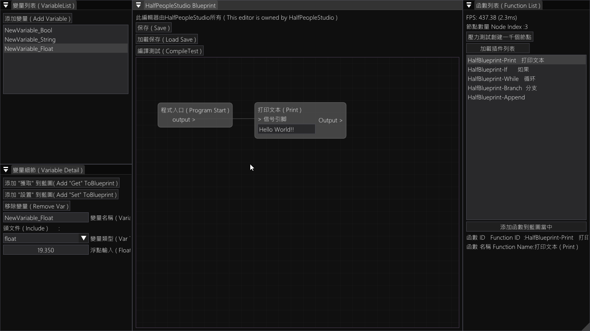

# HalfPeopleStudio-BluprintSystem
### 主要特性  Main features

- 可視化編程            Visual programming
- 內置兩種語言          Built-in two languages (中文 - English)
- 可使用插件             Plugins available
- 可以自製插件          custom plugins
- 有保存系統            have save system

- 自帶編譯器             Built-in compiler  --- 開發中 In development 45%
- 可兼容任意語言      Compatible with any language---開發中 In development 50%
- ... 

# HalfPeople Studio Blueprint Editor
### 半個人工作室藍圖編輯器


## 軟件介紹  Software introduction

>空空如也
>NULL

### 插件編輯 plugin editor

插件文件位於  Root/plugin/...  
可以在此處添加 任意名稱.txt (暫定)

Plugin files are located at Root/plugin/...can
be added here  any name.txt (tentative)

###### 添加編輯器運行時附加插件 .dll     --- Add editor runtime add-ons .dll
例如我需要添加 a.dll 和 b.dll
For example I need to add a.dll and b.dll
```
    <EditorPlugin>
    <Plugin File>a.dll<PluginName>HalfPeople BlueprintSystem A Plugin
    <Plugin File>b.dll<PluginName>HalfPeople BlueprintSystem B Plugin
```
#### 添加變量 Add variable
例如我需要添加一個字符串和布爾值
For example I need to add a single string and bool
```
<Half Variable>
<HVar Type>bool<HVar Text>布爾 ( bool )<HVar Color>1<>1<>1<>1<HVar Inculd><HVar InputMode>0<VarIntDefaultValue>0<VarTextDefaultValue><VarFloatDefaultValue>0.f<VarBoolDefaultValue>0<VarNotInputDefaultValue>
<HVar Type>std::string<HVar Text>字符串 ( string )<HVar Color>1<>1<>1<>1<HVar Inculd>#inculd <string><HVar InputMode>1<VarIntDefaultValue>0<VarTextDefaultValue>Null<VarFloatDefaultValue>0.f<VarBoolDefaultValue>0<VarNotInputDefaultValue>
```

#### 添加標準函數 Add standard functions
例如我需要一個 Print 和 判斷
For example I need to add print and if
```
<FunctionList>
<FunctionID>HalfBlueprint-Print   打印文本<HName>打印文本 ( Print )<Half Pin Input>signal<>> 信号引脚<>1<>1<>1<>1<>#include <iostream><>-1<Next>std::string<># 字符串 (String)<>1<>1<>1<>1<>#include <string><>1<Half Pin Output>signal<>Output ><>1<>1<>1<>1<><>-1<Half Code>std::cout <<<C Head Append><C End><Code End Append>;<\n><All Code End><PartitionSymbol><PeerOperation>-1<Half Inculd><Half End>
<FunctionID>HalfBlueprint-If      如果<HName>如果 ( if )<Half Pin Input>signal<>> 信号引脚<>1<>1<>1<>1<><>-1<Next>bool<>o> 为对的(is true) <>1<>1<>1<>1<><>0<Half Pin Output>signal<>对的 (True ) ><>1<>1<>1<>1<><>-1<Next>signal<>否则 (False) ><>1<>1<>1<>1<><>-1<Half Code>if(<C Head Append>	<C End><\n><Append>}<\n><Append>else<\n><Append>{<\n><Code End Append>)<\n><Append>{<\n><All Code End><\n><Append>}<PartitionSymbol><PeerOperation>1<Half Inculd><Half End>
```
